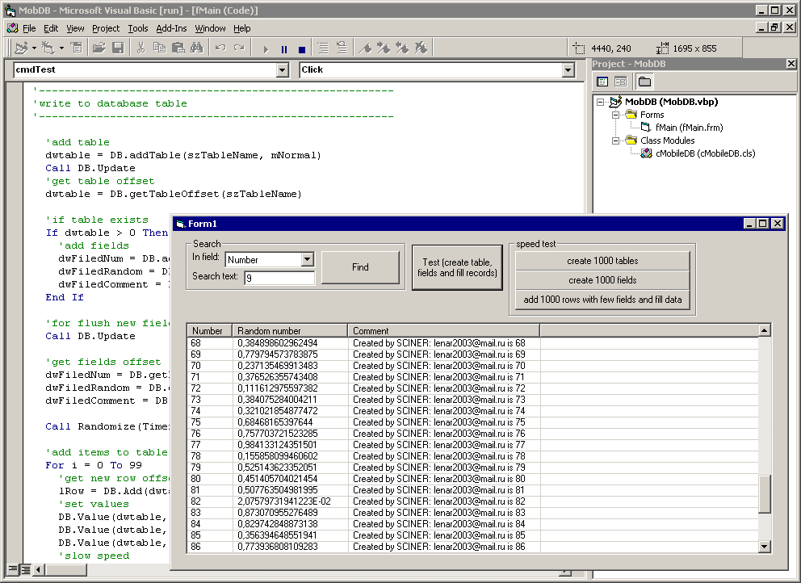

<div align="center">

## MobileDb v1\.2


</div>

### Description

Custom DataBase Engine Class Pure VB DataBase in one file. Tables, Fields, Rows, FieldTypes ... Without any DLL, OCX and other.
 
### More Info
 


<span>             |<span>
---                |---
**Submitted On**   |2006-11-03 17:10:02
**By**             |[SCINER](https://github.com/Planet-Source-Code/PSCIndex/blob/master/ByAuthor/sciner.md)
**Level**          |Advanced
**User Rating**    |4.7 (14 globes from 3 users)
**Compatibility**  |VB 5\.0, VB 6\.0
**Category**       |[Databases/ Data Access/ DAO/ ADO](https://github.com/Planet-Source-Code/PSCIndex/blob/master/ByCategory/databases-data-access-dao-ado__1-6.md)
**World**          |[Visual Basic](https://github.com/Planet-Source-Code/PSCIndex/blob/master/ByWorld/visual-basic.md)
**Archive File**   |[MobileDb\_v2028811132006\.zip](https://github.com/Planet-Source-Code/sciner-mobiledb-v1-2__1-66992/archive/master.zip)

### API Declarations

```
Private Declare Sub CopyMemory Lib "kernel32" Alias "RtlMoveMemory" (Destination As Any, Source As Any, ByVal Length As Long)
```


